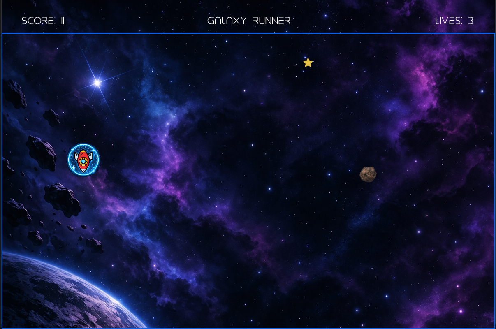

# 🚀 Galaxy Runner

Simple 2D space game made with Python and Pygame.

## 🎮 About the Game

In Galaxy Runner, you control a spaceship and try to survive as long as possible while collecting stars and avoiding asteroids.

* ⭐ Yellow stars increase your score and speed
* 🔴 Red stars give bonus points
* 🔵 Blue stars activate a temporary shield
* ☄️ Asteroids reduce your lives on collision

The goal is to get the highest score before losing all lives.

---

## 🛠️ Technologies Used

* Python
* Pygame

---

## ▶️ How to Run

1. Install pygame:

```
pip install pygame
```

2. Run the game:

```
python main.py
```

---

## 🎯 Features

* Player movement in all directions
* Collision detection (stars, asteroids, borders)
* Score and lives system
* Special power-ups (shield)
* Sound effects and background music
* Simple animation (explosion effect)

---

## 📸 Screenshot



---

## 💡 What I Learned

* Working with Pygame (movement, sprites, collisions)
* Basic game loop and timing
* Using classes and object-oriented programming
* Managing game states and events

---

## 🚧 Future Improvements

* Better UI / menu
* More power-ups
* Difficulty scaling
* Improved graphics and animations

